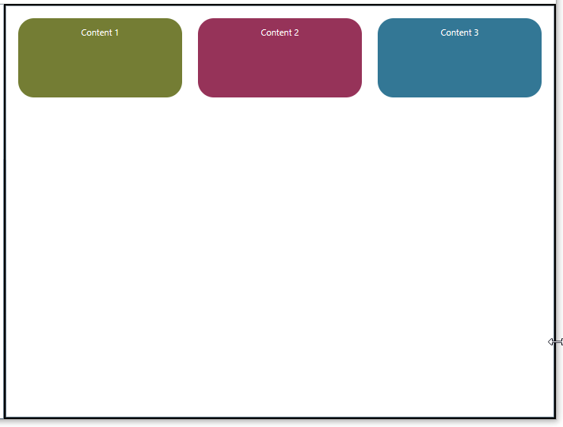
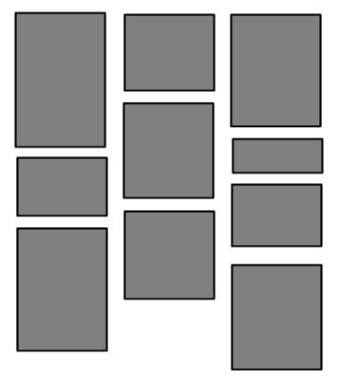
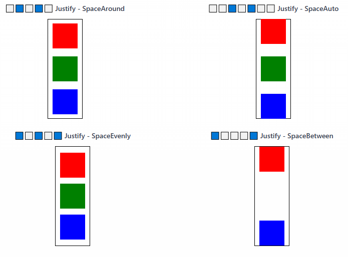

# OpenSilver.ControlsKit
The ControlsKit is a collection of additional libraries, controls, and helpers that developers can use directly in their OpenSilver projects, to complement the built-in controls. 

## AdaptiveColumnsPanel

A responsive that dynamically switches between layouts based on its width:
- when its width meets or exceeds <c>NoColumnsBelowWidth</c>, children are arranged into equal-width columns (one per visible child);
- otherwise, they are stacked vertically in a single column.

Child horizontal and vertical alignments are respected within each allocated slot.



Example of usage:

```xml
<Page
    x:Class="FastControls.TestApp.Pages.TestAdaptiveColumnsPanel"
    xmlns="http://schemas.microsoft.com/winfx/2006/xaml/presentation"
    xmlns:x="http://schemas.microsoft.com/winfx/2006/xaml"
    xmlns:controlskit="clr-namespace:OpenSilver.ControlsKit;assembly=OpenSilver.ControlsKit.Controls" xmlns:d="http://schemas.microsoft.com/expression/blend/2008" d:DesignWidth="512" d:DesignHeight="932" xmlns:mc="http://schemas.openxmlformats.org/markup-compatibility/2006" mc:Ignorable="d">

    <controlskit:AdaptiveColumnsPanel NoColumnsBelowWidth="400" VerticalAlignment="Top">

        <Border Height="100" CornerRadius="20" Margin="5" Background="#CC505E00">
            <TextBlock Text="Content 1" HorizontalAlignment="Center" Foreground="White" Margin="0,10,0,0"/>
        </Border>

        <Border Height="100" CornerRadius="20" Margin="5" Background="#CC7D0030">
            <TextBlock Text="Content 2" HorizontalAlignment="Center" Foreground="White" Margin="0,10,0,0"/>
        </Border>

        <Border Height="100" CornerRadius="20" Margin="5" Background="#CC00567A">
            <TextBlock Text="Content 3" HorizontalAlignment="Center" Foreground="White" Margin="0,10,0,0"/>
        </Border>

    </controlskit:AdaptiveColumnsPanel>

</Page>
```

## StaggeredPanel

A panel that arranges children in a masonry-like layout:
- It lays out children in columns of equal width but varying heights.
- It tries to balance the total height of each column, minimizing visual gaps.
- It's useful for dynamic content where each item may be a different size.



Example of usage:

```xml
<Page
    x:Class="TestApp.TestStaggeredPanel"
    xmlns="http://schemas.microsoft.com/winfx/2006/xaml/presentation"
    xmlns:x="http://schemas.microsoft.com/winfx/2006/xaml"
    xmlns:controlskit="clr-namespace:OpenSilver.ControlsKit;assembly=OpenSilver.ControlsKit.Controls">

    <controlskit:StaggeredPanel DesiredColumnWidth="100" RowSpacing="20" ColumnSpacing="20">
        <Border Width="100" Height="100" Background="Red"/>
        <Border Width="100" Height="300" Background="Blue"/>
        <Border Width="100" Height="200" Background="Green"/>
        <Border Width="500" Height="300" Background="Yellow"/>
    </controlskit:StaggeredPanel>

</Page>

```


## AnimatedNavigationBar

A navigation bar control with smooth animated transitions for position, width, and text color changes. It inherits from ListBox.


Example of usage:

```xml
<Page
    x:Class="TestApp.TestAnimatedNavigationBar"
    xmlns="http://schemas.microsoft.com/winfx/2006/xaml/presentation"
    xmlns:x="http://schemas.microsoft.com/winfx/2006/xaml"
    xmlns:controlskit="clr-namespace:OpenSilver.ControlsKit;assembly=OpenSilver.ControlsKit.Controls">
    <Page.Resources>

    <Style x:Key="BasicNavStyle" TargetType="controlskit:AnimatedNavigationBar">
        <Setter Property="Foreground" Value="#4B5563"/>
        <Setter Property="SelectedForeground" Value="#FFFFFF"/>
        <Setter Property="IndicatorBackground" Value="#3B82F6"/>
        <Setter Property="Background" Value="#F9FAFB"/>
        <Setter Property="CornerRadius" Value="10"/>
        <Setter Property="Padding" Value="8"/>
        <Setter Property="ItemPadding" Value="16,10"/>
        <Setter Property="AnimationDuration" Value="300"/>
        <Setter Property="IndicatorCornerRadius" Value="8"/>
        <Setter Property="FontSize" Value="14"/>
    </Style>

    <Style x:Key="SectionBorderStyle" TargetType="Border">
        <Setter Property="Background" Value="#F9FAFB"/>
        <Setter Property="Padding" Value="20"/>
        <Setter Property="CornerRadius" Value="12"/>
        <Setter Property="BorderBrush" Value="#E5E7EB"/>
        <Setter Property="BorderThickness" Value="1"/>
        <Setter Property="HorizontalAlignment" Value="Left"/>
        <Setter Property="VerticalAlignment" Value="Top"/>
    </Style>

    </Page.Resources>

    <Border Style="{StaticResource SectionBorderStyle}">

        <controlskit:AnimatedNavigationBar Style="{StaticResource BasicNavStyle}">

            <ListBoxItem Content="Home" IsSelected="True"/>
            <ListBoxItem Content="Products"/>
            <ListBoxItem Content="Services"/>
            <ListBoxItem Content="About"/>
            <ListBoxItem Content="Contact"/>

        </controlskit:AnimatedNavigationBar>

    </Border>

</Page>

```


## FlexPanel

**FlexPanel** is a layout panel similar to `StackPanel`, but with additional control over how children are spaced and aligned. It supports a layout model inspired by CSS Flexbox, making it easier to create clean, consistent UIs without extra nesting or manual margin tweaking.

#### Key features

- **Orientation**  
  Arrange children in a `Horizontal` or `Vertical` layout using the `Orientation` property, just like with `StackPanel`.

- **Justify**  
  Controls how space is distributed along the main axis. Options include:
  - `Start`
  - `Center`
  - `End`
  - `SpaceBetween`
  - `SpaceAround`
  - `SpaceEvenly`
  - `SpaceAuto`

- **Align**  
  Controls alignment along the cross axis.  
  Unlike `StackPanel`, where you typically set `HorizontalAlignment` or `VerticalAlignment` on each child, `FlexPanel` allows you to control all children’s alignment from the panel itself using the `Align` property.

- **Simplified layout**  
  Ideal for toolbars, button groups, or dashboards where you want consistent spacing and alignment without relying on `Grid` or setting margins manually.

#### Things to know

- **Child `Margin` is currently ignored**  
  Spacing is handled entirely by the panel based on the `Justify` setting. Margins set on individual children will not affect layout.

- **Children are arranged using their natural `DesiredSize`**  
  There is currently no support for stretching or shrinking children to fill space (no equivalent of `flex-grow` or `flex-shrink`).

- **No wrapping support**  
  Children are arranged in a single row or column only. If you need wrapping behavior, use a `WrapPanel` instead.

- **Simplified alignment options**  
  `Align` currently supports only `Start`, `Center`, and `End`. More advanced options like `baseline` or `stretch` are not implemented yet.

- **AddHeight property**  
  Adds extra vertical space to the layout, useful when additional height is needed beyond what the children require.

This panel is useful in scenarios where `StackPanel` is too limited, but using a `Grid` would add unnecessary complexity.



Example of usage:

```xml
<Page
    x:Class="TestApp.TestFlexPanel"
    xmlns="http://schemas.microsoft.com/winfx/2006/xaml/presentation"
    xmlns:x="http://schemas.microsoft.com/winfx/2006/xaml"
    xmlns:controlskit="clr-namespace:OpenSilver.ControlsKit;assembly=OpenSilver.ControlsKit.Controls">

    <StackPanel Orientation="Vertical">

        <TextBlock Style="{StaticResource SubTitleStyle}" Text="??????? Justify - SpaceAround" />
        <controlskit:FlexPanel Justify="SpaceAround" Orientation="Vertical">
            <Grid Width="50" Height="50" Background="Red" />
            <Grid Width="50" Height="50" Background="Green" />
            <Grid Width="50" Height="50" Background="Blue" />
        </controlskit:FlexPanel>
            
        <TextBlock Style="{StaticResource SubTitleStyle}" Text="????????? Justify - SpaceAuto" />
        <controlskit:FlexPanel Justify="SpaceAuto" Orientation="Vertical">
            <Grid Width="50" Height="50" Background="Red" />
            <Grid Width="50" Height="50" Background="Green" />
            <Grid Width="50" Height="50" Background="Blue" />
        </controlskit:FlexPanel>
            
        <TextBlock Style="{StaticResource SubTitleStyle}" Text="???????? Justify - SpaceEvenly" />
        <controlskit:FlexPanel Align="Center" Justify="SpaceEvenly" Orientation="Vertical">
            <Grid Width="50" Height="50" ackground="Red" />
            <Grid Width="50" Height="50" Background="Green" />
            <Grid Width="50" Height="50" Background="Blue" />
        </controlskit:FlexPanel>

        <TextBlock Style="{StaticResource SubTitleStyle}" Text="??????? Justify - SpaceBetween" />
        <controlskit:FlexPanel Align="Center" Justify="SpaceBetween" Orientation="Vertical">
            <Grid Width="50" Height="50" Background="Red" />
            <Grid Width="50" Height="50" Background="Blue" />
        </controlskit:FlexPanel>

    </StackPanel>
</Page>

```