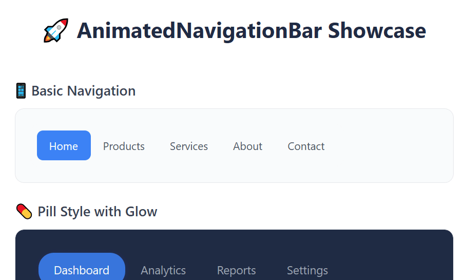

# OpenSilver.ControlsKit
The ControlsKit is a collection of additional libraries, controls, and helpers that developers can use directly in their OpenSilver projects, to complement the built-in controls. 

## AdaptiveColumnsPanel

A responsive that dynamically switches between layouts based on its width:
- when its width meets or exceeds <c>NoColumnsBelowWidth</c>, children are arranged into equal-width columns (one per visible child);
- otherwise, they are stacked vertically in a single column.

Child horizontal and vertical alignments are respected within each allocated slot.


Example of usage:

```xml
<Page
    x:Class="FastControls.TestApp.Pages.TestAdaptiveColumnsPanel"
    xmlns="http://schemas.microsoft.com/winfx/2006/xaml/presentation"
    xmlns:x="http://schemas.microsoft.com/winfx/2006/xaml"
    xmlns:controlskit="clr-namespace:OpenSilver.ControlsKit;assembly=OpenSilver.ControlsKit.Controls" xmlns:d="http://schemas.microsoft.com/expression/blend/2008" d:DesignWidth="512" d:DesignHeight="932" xmlns:mc="http://schemas.openxmlformats.org/markup-compatibility/2006" mc:Ignorable="d">

    <controlskit:AdaptiveColumnsPanel NoColumnsBelowWidth="400" VerticalAlignment="Top">

        <Border Height="100" CornerRadius="20" Margin="5" Background="#CC505E00">
            <TextBlock Text="Content 1" HorizontalAlignment="Center" Foreground="White" Margin="0,10,0,0"/>
        </Border>

        <Border Height="100" CornerRadius="20" Margin="5" Background="#CC7D0030">
            <TextBlock Text="Content 2" HorizontalAlignment="Center" Foreground="White" Margin="0,10,0,0"/>
        </Border>

        <Border Height="100" CornerRadius="20" Margin="5" Background="#CC00567A">
            <TextBlock Text="Content 3" HorizontalAlignment="Center" Foreground="White" Margin="0,10,0,0"/>
        </Border>

    </controlskit:AdaptiveColumnsPanel>

</Page>
```

## StaggeredPanel

A panel that arranges children in a masonry-like layout:
- It lays out children in columns of equal width but varying heights.
- It tries to balance the total height of each column, minimizing visual gaps.
- It's useful for dynamic content where each item may be a different size.


Example of usage:

```xml
<Page
    x:Class="TestApp.TestStaggeredPanel"
    xmlns="http://schemas.microsoft.com/winfx/2006/xaml/presentation"
    xmlns:x="http://schemas.microsoft.com/winfx/2006/xaml"
    xmlns:controlskit="clr-namespace:OpenSilver.ControlsKit;assembly=OpenSilver.ControlsKit.Controls">

    <controlskit:StaggeredPanel DesiredColumnWidth="100" RowSpacing="20" ColumnSpacing="20">
        <Border Width="100" Height="100" Background="Red"/>
        <Border Width="100" Height="300" Background="Blue"/>
        <Border Width="100" Height="200" Background="Green"/>
        <Border Width="500" Height="300" Background="Yellow"/>
    </controlskit:StaggeredPanel>

</Page>

```


## AnimatedNavigationBar

A navigation bar control with smooth animated transitions for position, width, and text color changes. It inherits from ListBox.



Example of usage:

```xml
<Page
    x:Class="TestApp.TestAnimatedNavigationBar"
    xmlns="http://schemas.microsoft.com/winfx/2006/xaml/presentation"
    xmlns:x="http://schemas.microsoft.com/winfx/2006/xaml"
    xmlns:controlskit="clr-namespace:OpenSilver.ControlsKit;assembly=OpenSilver.ControlsKit.Controls">
    <Page.Resources>

    <Style x:Key="BasicNavStyle" TargetType="controlskit:AnimatedNavigationBar">
        <Setter Property="Foreground" Value="#4B5563"/>
        <Setter Property="SelectedForeground" Value="#FFFFFF"/>
        <Setter Property="IndicatorBackground" Value="#3B82F6"/>
        <Setter Property="Background" Value="#F9FAFB"/>
        <Setter Property="CornerRadius" Value="10"/>
        <Setter Property="Padding" Value="8"/>
        <Setter Property="ItemPadding" Value="16,10"/>
        <Setter Property="AnimationDuration" Value="300"/>
        <Setter Property="IndicatorCornerRadius" Value="8"/>
        <Setter Property="FontSize" Value="14"/>
    </Style>

    <Style x:Key="SectionBorderStyle" TargetType="Border">
        <Setter Property="Background" Value="#F9FAFB"/>
        <Setter Property="Padding" Value="20"/>
        <Setter Property="CornerRadius" Value="12"/>
        <Setter Property="BorderBrush" Value="#E5E7EB"/>
        <Setter Property="BorderThickness" Value="1"/>
        <Setter Property="HorizontalAlignment" Value="Left"/>
        <Setter Property="VerticalAlignment" Value="Top"/>
    </Style>

    </Page.Resources>

    <Border Style="{StaticResource SectionBorderStyle}">

        <controlskit:AnimatedNavigationBar Style="{StaticResource BasicNavStyle}">

            <ListBoxItem Content="Home" IsSelected="True"/>
            <ListBoxItem Content="Products"/>
            <ListBoxItem Content="Services"/>
            <ListBoxItem Content="About"/>
            <ListBoxItem Content="Contact"/>

        </controlskit:AnimatedNavigationBar>

    </Border>

</Page>

```
